 
## 查看主页获取源码

### 一、作品包含

源码+数据库+设计文档万字+PPT+全套环境和工具资源+部署教程

### 二、项目技术

前端技术：Html、Css、Js、Vue、Element-ui

数据库：MySQL

后端技术：Java、Spring Boot、MyBatis

  

### 三、运行环境

开发工具：IDEA/eclipse

数据库：MySQL5.7

数据库管理工具：Navicat10以上版本

环境配置软件： JDK1.8+Maven3.6.3

前端Nodejs：14

### 四、项目介绍
项目编号：springbootA179

个人健康管理网站是为了帮助用户更好地管理自己的健康状况，提供个性化的健康建议和指导，以及分享健康知识和经验而开发的。系统以个人健康管理为核心，结合互联网时代信息传播的特点，旨在为用户提供一个便捷、高效、个性化的健康管理平台。通过该系统，用户可以方便地记录自己的健康状况等。同时，帮助用户更好地了解自己的健康状况，并采取相应的措施。此外，个人健康管理网站还具备良好的用户体验和可扩展性，为用户带来愉悦的健康管理体验。

前台用户功能：浏览首页、健康知识、疫情资讯、康友圈、实时资讯、后台管理、健康咨询和个人中心。

后台分为管理员和用户
管理员的功能：系统首页、个人中心、用户管理、健康知识管理、疫情资讯管理、健康信息推荐、康友圈、系统管理。
用户的功能：系统首页、个人中心、健康信息推荐。

### 五、运行截图

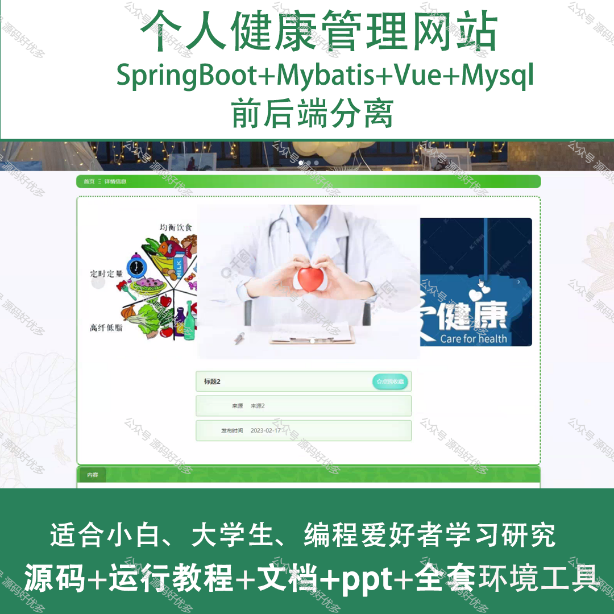
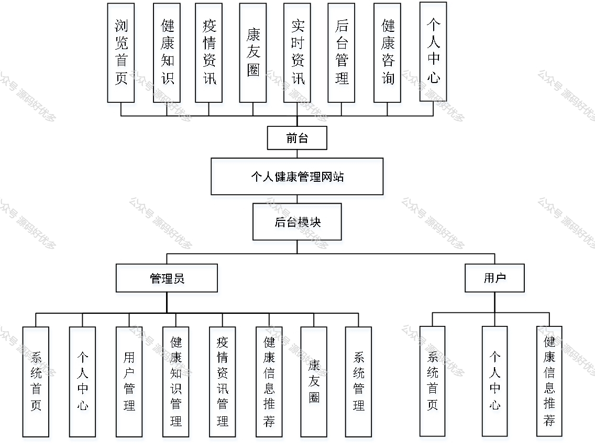
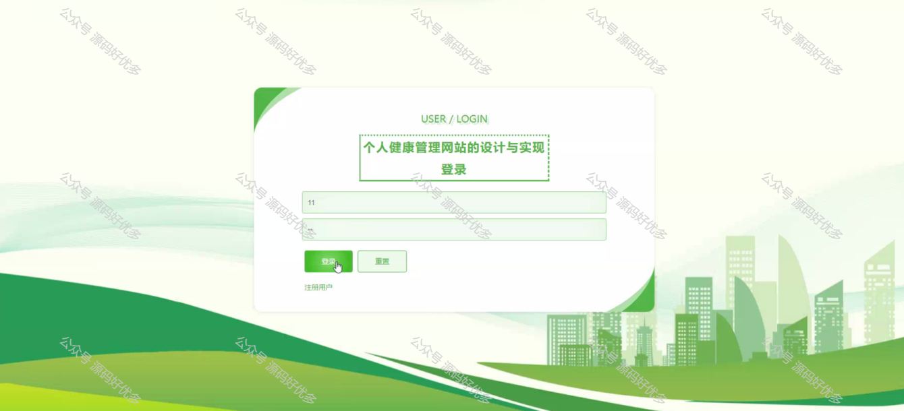
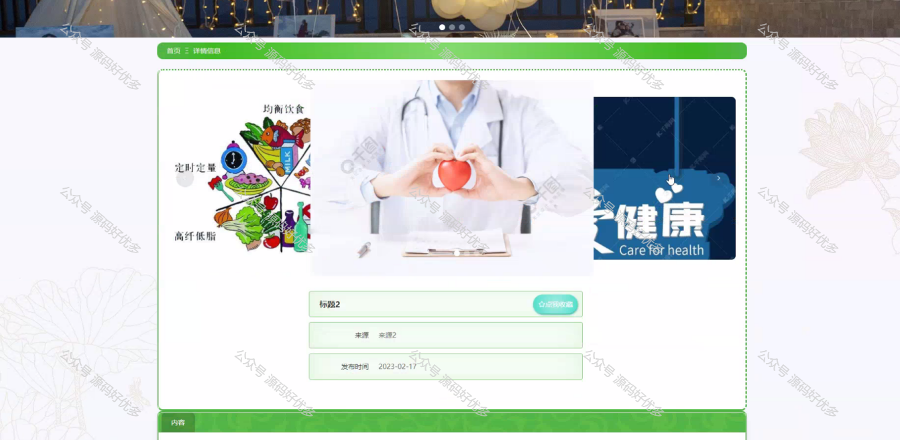
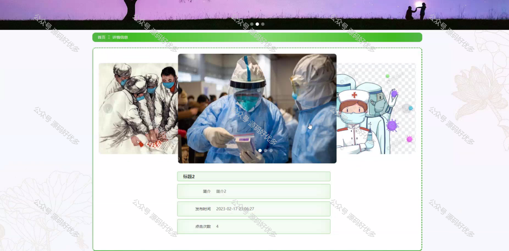
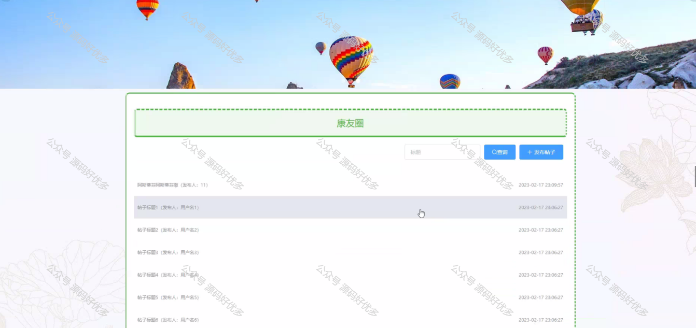
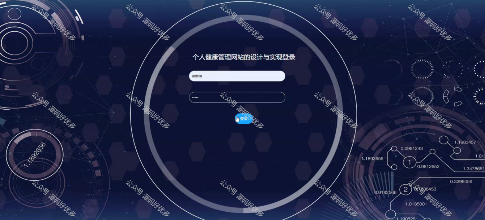
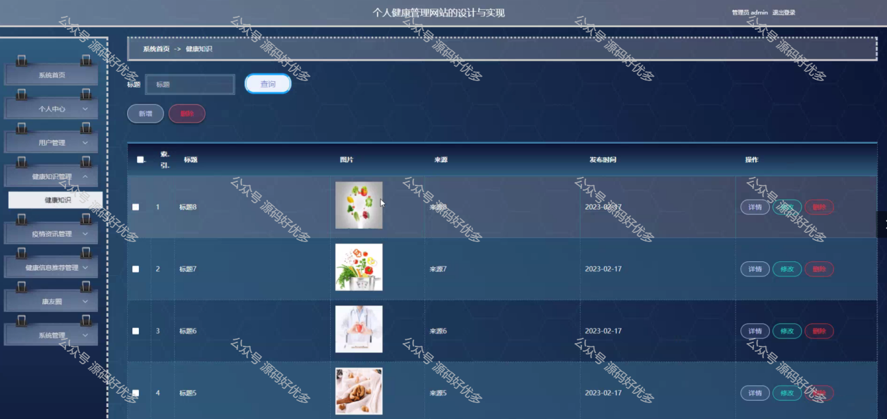
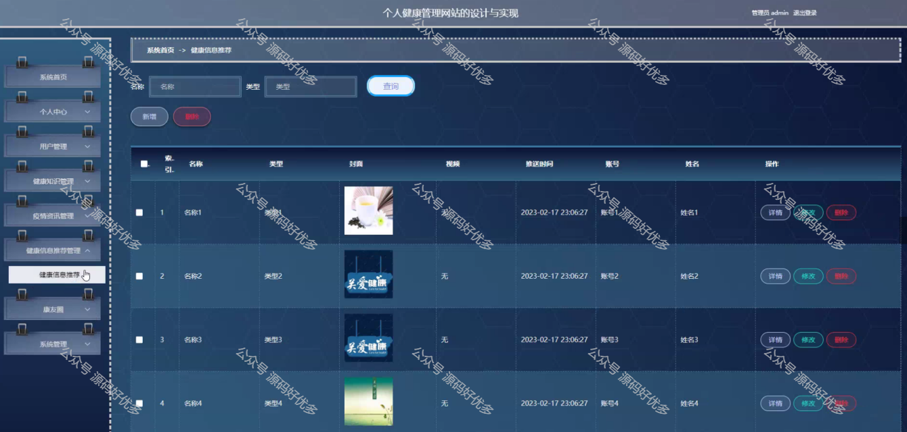
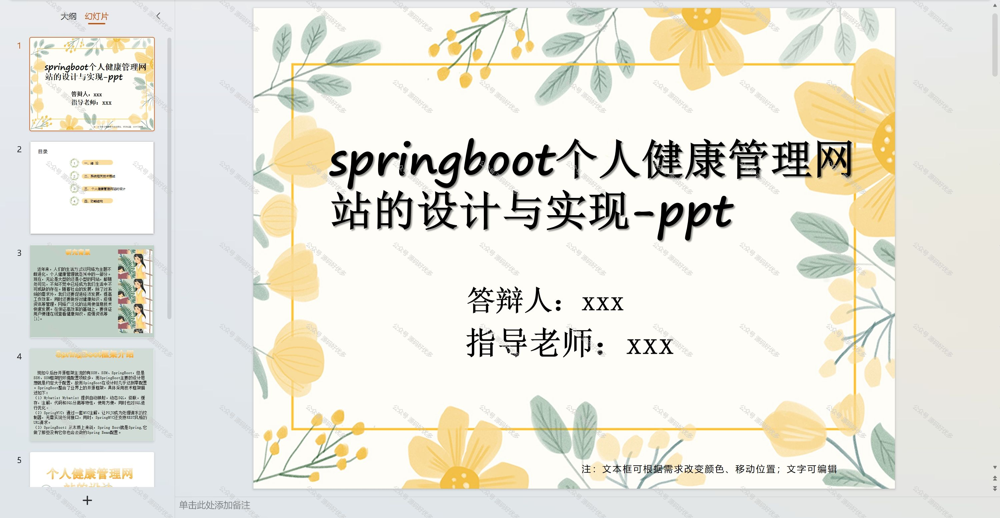
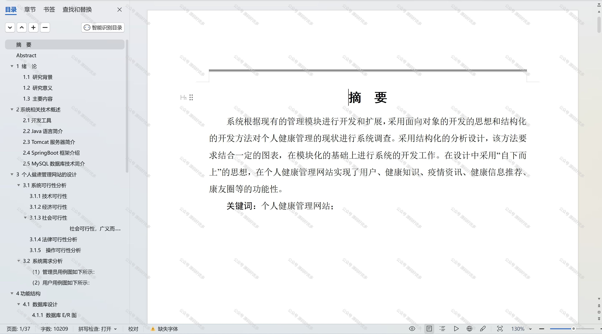

  

